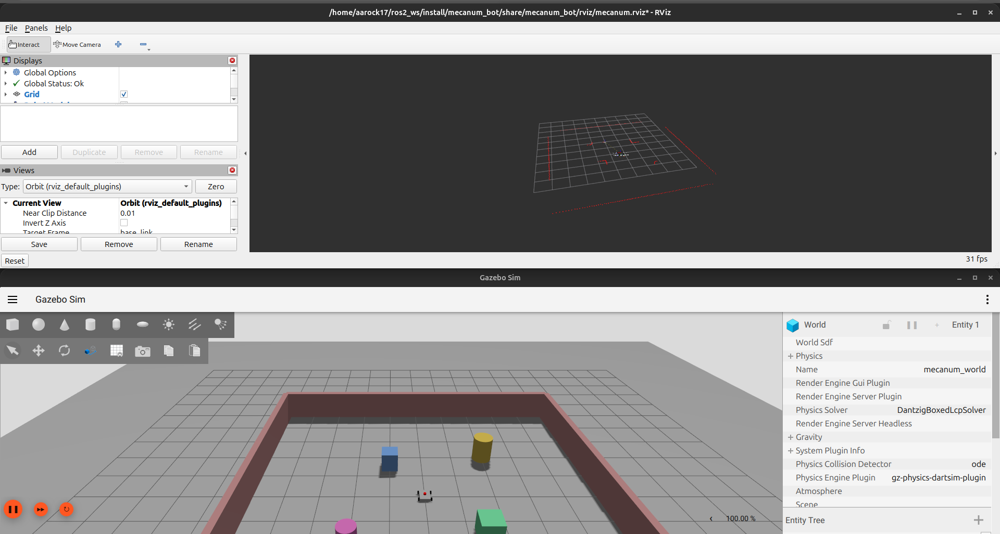

# Mecanum Bot ROS 2 Simulation 🤖



A fully simulated autonomous 4-wheel mecanum drive robot environment. 

## 🛠️ Tech Stack
* **OS:** Ubuntu 24.04
* **Framework:** ROS 2 (Jazzy Jalisco)
* **Simulation:** Gazebo Harmonic
* **Hardware Emulation:** LIDAR, mecanum drive base
* **Control:** `gz_ros2_control`

## ✨ Features
* Custom `mecanum_world` environment built in Gazebo
* Asynchronous SLAM mapping using `slam_toolbox`
* Real-time spatial visualization in RViz
* Custom Python-based autonomous waypoint follower (`waypoint_follower_big.py`) utilizing odometry data
* Custom `odom_tf_relay` for smooth coordinate transformations

## 🚀 How to Run


**1. Clone the repository:**
```bash
cd ~/ros2_ws/src
git clone [https://github.com/Amin-Ahmed-G/mecanum_bot.git](https://github.com/Amin-Ahmed-G/mecanum_bot.git)
